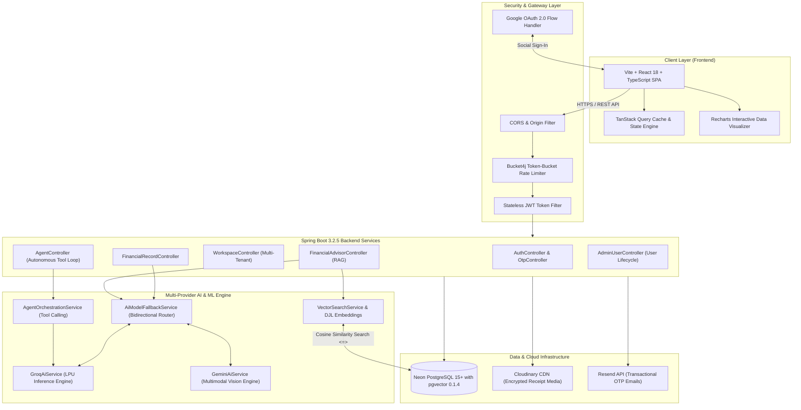
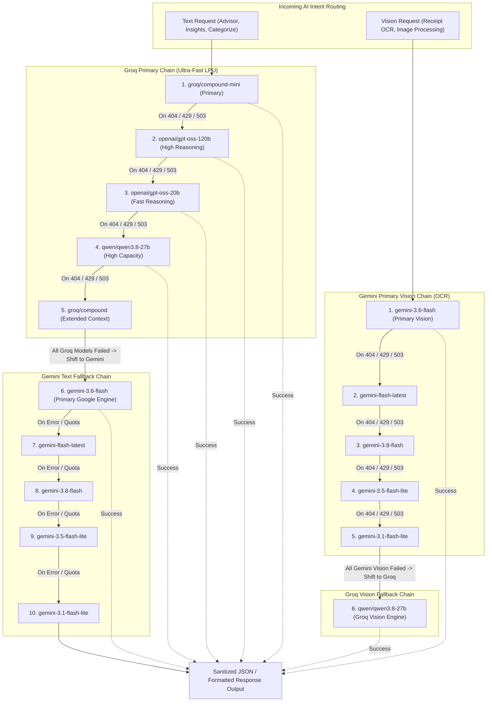
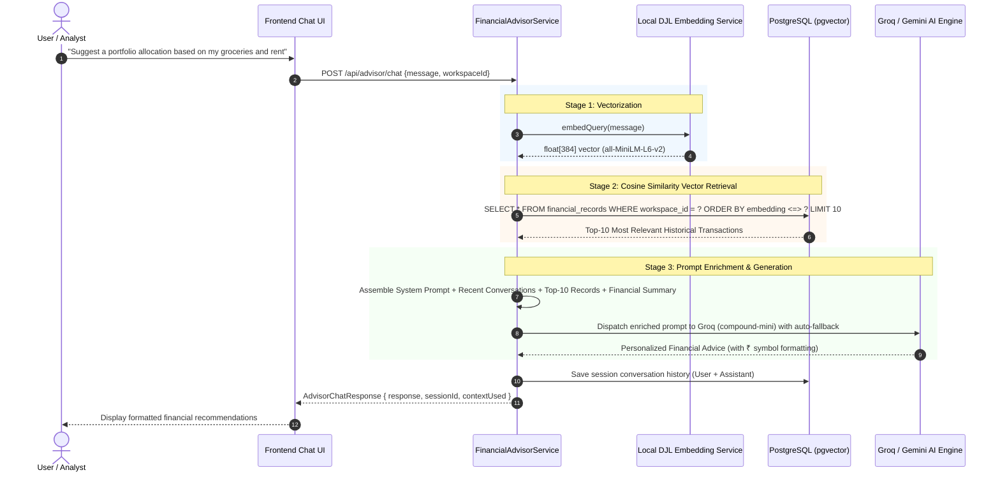
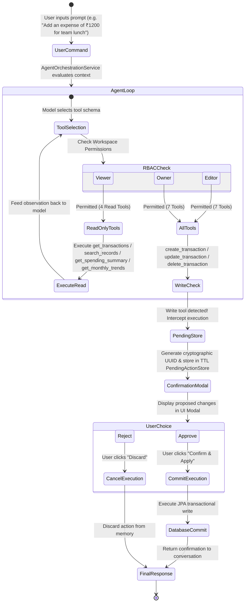
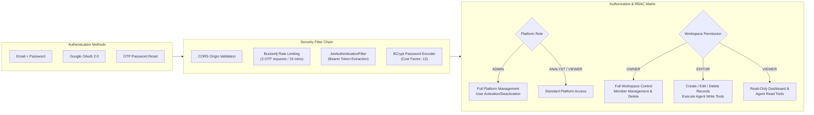
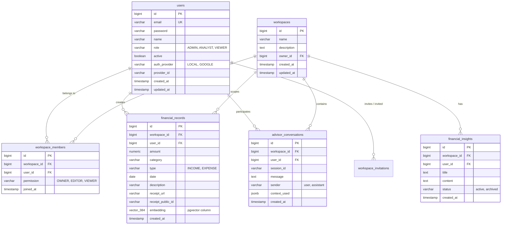

<p align="center">
  
</p>

<h1 align="center">Ledgera — AI-Powered Enterprise Financial Operating System</h1>

<p align="center">
  <b>Autonomous Financial Agents • Multi-Tier Cross-Provider AI Fallbacks • RAG Vector Search • Multi-Tenant Workspace Collaboration</b>
</p>

<p align="center">
  <a href="https://ledgera-finance-system.vercel.app"></a>
  <a href="https://rakinmohammedrafeeq.vercel.app"></a>
  <a href="LICENSE"></a>
  <a href="CHANGELOG.md"></a>
  <a href="CONTRIBUTING.md"></a>
</p>

<div align="center">

  [](https://www.oracle.com/java/)
  [](https://spring.io/projects/spring-boot)
  [](https://reactjs.org/)
  [](https://www.typescriptlang.org/)
  [](https://vite.dev/)
  [](https://tanstack.com/query)
  [](https://www.postgresql.org/)
  [](https://github.com/pgvector/pgvector)
  [](https://groq.com/)
  [](https://ai.google.dev/)
  [](https://cloudinary.com/)
  [](https://tailwindcss.com/)

</div>

---

## 📑 Table of Contents

- [Executive Overview](#-executive-overview)
  - [What is Ledgera in Simple Terms?](#what-is-ledgera-in-simple-terms)
  - [Real-World Use Cases](#real-world-use-cases)
  - [Why Ledgera Solves Modern Financial Pain Points](#why-ledgera-solves-modern-financial-pain-points)
- [System Architecture](#-system-architecture)
  - [1. High-Level System Architecture](#1-high-level-system-architecture)
  - [2. Multi-Tier Cross-Provider AI Fallback Engine](#2-multi-tier-cross-provider-ai-fallback-engine)
  - [3. RAG Semantic Search Pipeline (Retrieval-Augmented Generation)](#3-rag-semantic-search-pipeline-retrieval-augmented-generation)
  - [4. Autonomous AI Agent Loop & Two-Phase Write Protocol](#4-autonomous-ai-agent-loop--two-phase-write-protocol)
  - [5. Security, OAuth2, and RBAC Architecture](#5-security-oauth2-and-rbac-architecture)
  - [6. Database Entity-Relationship Diagram (ERD)](#6-database-entity-relationship-diagram-erd)
- [Key Features Breakdown](#-key-features-breakdown)
- [Technology Stack](#-technology-stack)
- [Repository Structure](#-repository-structure)
- [Environment Configuration](#-environment-configuration)
- [Local Development & Quickstart](#-local-development--quickstart)
- [REST API Reference](#-rest-api-reference)
- [Production Deployment](#-production-deployment)
- [Performance & Security Hardening](#-performance--security-hardening)
- [Troubleshooting & FAQ](#-troubleshooting--faq)
- [Technology Decisions & Rationale](#-technology-decisions--rationale)
- [Contributing](#-contributing)
- [License](#-license)
- [Acknowledgments](#-acknowledgments)
- [Contact](#-contact)
- [Support](#-support)

---

## 🌟 Executive Overview

### What is Ledgera in Simple Terms?

Imagine having a **chief financial officer, a certified bookkeeper, and a data scientist** working inside your computer around the clock:

1. **You take a picture of a wrinkled paper receipt with your phone** — Ledgera instantly reads the merchant, total, sales tax, transaction date, and files it away into your accounts.
2. **You ask a question in plain English** (*"Can my business afford to hire another contractor next month?"* or *"Suggest a portfolio allocation for my savings"*) — Ledgera's RAG advisor searches through every transaction you have ever made, analyzes your spending habits, and gives you tailored, mathematically sound guidance with ₹ currency support.
3. **You tell the autonomous agent** (*"Record a ₹450 Uber trip for client meeting"* or *"Find all travel expenses last quarter"*) — the agent plans its actions, executes search tools, and queues any database modifications into a protected confirmation modal so you remain in 100% control of your ledger.
4. **Your team shares dedicated workspaces** — team members have exact permissions (Owners, Editors, Viewers), ensuring sensitive salary and tax details stay segregated from operational staff.

### Real-World Use Cases

| Persona / Business | The Challenge | How Ledgera Solves It |
| :--- | :--- | :--- |
| **Freelancers & Solopreneurs** | Hours lost manually typing invoices, forgetting tax write-offs, and guessing tax brackets. | Snap photo receipts on mobile. AI extracts data into tax-deductible categories automatically with instant confidence scoring. |
| **Startups & Small Teams** | Mixing personal and company accounts, lack of role clarity, lost expense records. | Multi-workspace collaboration. Create separate workspaces for "Engineering", "Marketing", or "Personal". Assign role-based access. |
| **Financial Planners & Analysts** | Traditional spreadsheets provide static numbers with zero contextual reasoning. | Ask natural-language questions to the RAG Advisor; get answers grounded in real transactional history via pgvector semantic search. |
| **Enterprise Administrators** | Security breaches, unmonitored user accounts, and API quota crashes. | Complete user lifecycle management, Google OAuth2 social login, Bucket4j rate limiting, and zero-downtime multi-provider AI failovers. |

### Why Ledgera Solves Modern Financial Pain Points

- **Zero-Downtime Multi-Provider AI Fallback:** Never experience downtime when a single AI model is rate-limited or decommissioned. Ledgera intelligently falls back through multiple models across Groq and Google Gemini.
- **Privacy-Centric Local Embeddings:** Financial transactions are transformed into vector embeddings locally on the JVM server using PyTorch (`all-MiniLM-L6-v2`) without shipping private financial history to paid third-party embedding APIs.
- **Two-Phase Human-in-the-Loop Safeguard:** AI agents cannot silently alter your bank book. Destructive actions (`create`, `update`, `delete`) are staged in a cryptographically secured TTL pending store for human approval.

---

## 🏗 System Architecture

### 1. High-Level System Architecture

Ledgera follows a clean, modern **Modular Monolith** architecture backed by a decoupled Single Page Application (SPA) frontend, cloud edge media storage, and a vector-enabled relational database:



---

### 2. Multi-Tier Cross-Provider AI Fallback Engine

Ledgera implements an industry-leading **bidirectional fallback architecture**. If a primary model fails due to a rate limit (HTTP 429), quota exhaustion, service downtime (HTTP 503), or model decommissioning (HTTP 404), the engine automatically tries sequential backup models before crossing over to an alternate cloud AI provider:



---

### 3. RAG Semantic Search Pipeline (Retrieval-Augmented Generation)

When a user asks questions about their finances, Ledgera doesn't rely on generic LLM knowledge. It grounds every answer in the user's real transactions using vector embeddings:



---

### 4. Autonomous AI Agent Loop & Two-Phase Write Protocol

The autonomous agent accepts natural language commands and executes multi-step plans using 7 discrete tools. To maintain strict financial integrity, **read actions execute automatically**, while **write actions require explicit user confirmation**:



---

### 5. Security, OAuth2, and RBAC Architecture

Ledgera uses a defense-in-depth security model combining stateless authentication, brute-force protection, and fine-grained authorization:



---

### 6. Database Entity-Relationship Diagram (ERD)



---

## ⚡ Key Features Breakdown

### 1. 🤖 Multi-Provider AI Engine with 10-Tier Failover
- **Intelligent Routing:** Automatically sends text operations to ultra-fast Groq LPU models and vision operations to Gemini 3.6 Flash.
- **Fail-Safe Resilience:** If any model hits a rate limit (HTTP 429), returns 404, or goes down (HTTP 503), the engine tries consecutive fallbacks across both Groq and Google Gemini before ever failing.
- **Zero Hallucination Currency Enforcement:** All financial calculations and AI advisors strictly output amounts formatted in the user's localized currency (`₹` Rupee by default).

### 2. 🧾 Multimodal Receipt OCR & Auto-Filing
- **High-Accuracy Vision:** Powered by `gemini-3.6-flash` with fallback to Groq's multimodal `qwen/qwen3.8-27b`.
- **Instant Extraction:** Pulls merchant name, purchase date, total amount, taxes, category, and income/expense classification from phone snapshots or PDF invoices.
- **Cloudinary CDN Integration:** Automatically uploads, compresses, optimizes, and serves receipt images through global edge CDN endpoints.

### 3. 🧠 RAG-Powered Financial Advisor
- **Local Embedded Search:** Generates 384-dimensional dense vector representations of all transactions via Deep Java Library (DJL) and PyTorch (`all-MiniLM-L6-v2`) inside the JVM.
- **PostgreSQL pgvector:** Queries the closest semantic records using the cosine distance operator (`<=>`) in sub-10ms.
- **Context-Aware Recommendations:** Delivers personalized advice on portfolio allocations, tax strategies, and savings projections grounded in actual account activity.

### 4. 🛠 Autonomous AI Agent (7 Tools + 2-Phase Commit)
- **7 Discrete Tools:**
  1. `get_transactions` — Flexible filtering and querying of financial entries.
  2. `get_spending_summary` — Aggregates spending by categories.
  3. `search_records` — Full-text keyword and metadata search.
  4. `get_monthly_trends` — Computes period-over-period cash flow trajectories.
  5. `create_transaction` — Creates new income/expense entries *(Requires Confirmation)*.
  6. `update_transaction` — Modifies existing records *(Requires Confirmation)*.
  7. `delete_transaction` — Removes records permanently *(Requires Confirmation)*.
- **TTL Pending Action Store:** Write operations generate a secure token with an expiration window. The user is prompted with a transparent comparison diff modal before any record is touched.

### 5. 🏢 Multi-Tenant Workspace Collaboration
- **Isolated Environments:** Keep personal finances, joint accounts, and business ledgers strictly isolated under distinct workspace IDs.
- **Granular RBAC:**
  - **Owner:** Complete control, workspace deletion, billing, and invitation authority.
  - **Editor:** Full transaction lifecycle and access to all 7 agent tools.
  - **Viewer:** Read-only access to records, charts, and read-only AI tools.
- **Collaborative Invites:** Invite team members and accountants via verified email notifications.

### 6. 📊 Real-Time Financial Analytics
- **Dynamic Charting:** Area charts with gradient fills for income vs. expense cash flow, horizontal bar charts for category breakdowns, and monthly burn-rate calculators powered by Recharts.
- **TanStack Query Cache:** Eliminates redundant API calls with optimistic updates, stale-while-revalidate policies, and instant background synchronization.
- **System Theme Harmony:** Dark, light, and system-adaptive modes rendered with Radix UI and Tailwind CSS 4.x.

---

## 💻 Technology Stack

| Layer | Technology | Version | Purpose & Rationale |
| :--- | :--- | :--- | :--- |
| **Backend Framework** | Java / Spring Boot | `17+` / `3.2.5` | Enterprise-grade stability, robust type safety, dependency injection, and mature security ecosystem. |
| **Persistence & ORM** | Spring Data JPA / Hibernate | `3.2.5` | High-performance ORM, typed Criteria APIs, connection pooling with HikariCP, and automated schema migration. |
| **Database** | PostgreSQL + pgvector | `15+` / `0.1.4` | ACID transactional reliability for financial ledgers combined with high-speed vector similarity search. |
| **Machine Learning** | Deep Java Library (DJL) | `0.28.0` | In-process PyTorch engine executing `all-MiniLM-L6-v2` locally for zero-cost, private semantic embeddings. |
| **AI Cloud: Groq** | Groq LPU Inference | `REST / OpenAI Spec` | Industry-leading inference speed (~280 tokens/sec) for conversational advice, categorization, and tool loops. |
| **AI Cloud: Google** | Google Gemini API | `v1beta` | Multimodal document comprehension and high-accuracy OCR for receipt parsing. |
| **Security & Auth** | Spring Security / JJWT | `6.2` / `0.12.5` | Stateless JWT tokens, BCrypt password hashing (factor 12), and method-level pre-authorization guards. |
| **Social Sign-In** | Google OAuth 2.0 | `v2` | Frictionless user onboarding via "Continue with Google" social login. |
| **Rate Limiting** | Bucket4j | `8.7.0` | Token-bucket algorithm protecting authentication and OTP endpoints against credential stuffing and brute-force. |
| **Email Gateway** | Resend API Client | `3.0.0` | High-deliverability transactional email service for password reset OTP verification. |
| **Media Management** | Cloudinary Java SDK | `1.38.0` | Encrypted image storage, automatic WebP/AVIF format transcoding, and edge CDN acceleration. |
| **Frontend Framework** | React / TypeScript | `18.3.1` / `5.7.3` | Predictable state rendering, strict compile-time type safety, and modern hook abstractions. |
| **Build & Tooling** | Vite | `5.4.10` | Instant hot module replacement (HMR) and optimized rollup production bundles. |
| **State & Data Sync** | TanStack Query | `5.60.5` | Declarative server-state management, cache deduplication, and optimistic mutations. |
| **Styling & UI Primitives** | Tailwind CSS / Radix UI | `4.2` / `Latest` | Accessible unstyled UI primitives combined with atomic utility styling and glassmorphism. |
| **Data Visualization** | Recharts | `2.15.0` | Declarative, mobile-responsive SVG charts with smooth easing curves and custom tooltips. |

---

## 📁 Repository Structure

```text
ledgera/
├── backend/                                # Spring Boot 3.2.5 Core Server
│   ├── src/main/java/com/ledgera/
│   │   ├── config/                         # Infrastructure Configurations
│   │   │   ├── DataInitializer.java        # Default database seeding & admin creation
│   │   │   ├── EmailConfig.java            # Resend API email provider configuration
│   │   │   ├── OAuth2Config.java           # Google OAuth 2.0 security configuration
│   │   │   ├── RateLimitConfig.java        # Bucket4j token-bucket rate limiting rules
│   │   │   └── SecurityConfig.java         # Spring Security 6 filter chain & CORS
│   │   ├── controller/                     # REST API Controllers
│   │   │   ├── AdminUserController.java    # Platform-wide user management (Admin only)
│   │   │   ├── AgentController.java        # AI Autonomous Agent execution & confirmation
│   │   │   ├── AiController.java           # Categorization, OCR receipt parsing & insights
│   │   │   ├── AuthController.java         # Register, Login, OAuth2 social login
│   │   │   ├── DashboardController.java    # Workspace aggregation and financial telemetry
│   │   │   ├── FinancialAdvisorController.java # RAG advisor chat & manual reindex
│   │   │   ├── FinancialRecordController.java  # CRUD financial records with filtering
│   │   │   ├── OtpController.java          # Password reset verification flow
│   │   │   └── WorkspaceController.java    # Multi-tenant workspace management
│   │   ├── dto/                            # Data Transfer Objects & API Contracts
│   │   ├── entity/                         # JPA Entities (PostgreSQL Tables)
│   │   │   ├── AdvisorConversation.java    # RAG Chat history
│   │   │   ├── FinancialInsight.java       # Proactive financial notices
│   │   │   ├── FinancialRecord.java        # Transaction record with vector(384)
│   │   │   ├── User.java                   # Account credentials, roles, and status
│   │   │   ├── Workspace.java              # Tenant organizational boundary
│   │   │   └── WorkspaceMember.java        # RBAC membership mapping
│   │   ├── enums/                          # System Enumerations (Role, Permission, Type)
│   │   ├── repository/                     # Spring Data JPA Repositories
│   │   ├── security/                       # JWT Filters & Permission Evaluators
│   │   └── service/                        # Domain Business Logic
│   │       ├── AgentOrchestrationService.java # Multi-step autonomous agent planner
│   │       ├── AgentToolExecutorService.java  # Tool execution router
│   │       ├── AgentToolRegistry.java         # OpenAI-spec tool schema catalog
│   │       ├── AiModelFallbackService.java    # Bidirectional cross-provider AI router
│   │       ├── EmbeddingService.java          # Local PyTorch all-MiniLM-L6-v2 embeddings
│   │       ├── FinancialAdvisorService.java   # RAG prompt construction & context retrieval
│   │       ├── GeminiAiService.java           # Multimodal vision & Gemini adapter
│   │       ├── GroqAiService.java             # High-speed Groq LPU completion adapter
│   │       ├── PendingActionStore.java        # Two-phase write confirmation store
│   │       └── VectorSearchService.java       # pgvector cosine similarity search engine
│   ├── src/main/resources/
│   │   ├── application.properties          # Base Spring configuration
│   │   └── db/migration/                   # Flyway SQL schema versioning scripts
│   ├── Dockerfile                          # Multi-stage production container build
│   ├── pom.xml                             # Maven dependency configuration
│   ├── validate-gemini-key.ps1             # Windows Gemini API validation utility
│   └── validate-gemini-key.sh              # Unix Gemini API validation utility
├── frontend/                               # React 18 + Vite SPA Client
│   ├── src/
│   │   ├── components/                     # Reusable UI Components
│   │   │   ├── advisor/                    # RAG Advisor & Autonomous Agent chat panels
│   │   │   ├── dashboard/                  # KPI Metric cards & Recharts visualization
│   │   │   ├── layout/                     # Sidebar, Navbar, and Workspace Switcher
│   │   │   ├── records/                    # Transaction data tables, modals & OCR upload
│   │   │   └── ui/                         # Accessible Radix UI components
│   │   ├── context/                        # AuthContext & WorkspaceContext state
│   │   ├── hooks/                          # Custom React & TanStack Query hooks
│   │   ├── pages/                          # Primary view routes (Dashboard, Records, Admin)
│   │   ├── services/                       # Axios API communication clients
│   │   └── types/                          # TypeScript interface contracts
│   ├── package.json                        # Frontend dependencies & scripts
│   └── vite.config.ts                      # Vite build optimization configuration
├── render.yaml                             # Render Cloud infrastructure blueprint
└── vercel.json                             # Vercel SPA routing & cache configuration
```

---

## ⚙️ Environment Configuration

Ledgera uses environment variables for configuration. Create `.env` files in both `backend/` and `frontend/` directories.

### Backend Configuration (`backend/.env`)

```ini
# ===================================================================
# Database Configuration (Neon PostgreSQL with pgvector)
# ===================================================================
DB_URL=jdbc:postgresql://your-neon-host.aws.neon.tech/neondb?sslmode=require
DB_USERNAME=your_db_user
DB_PASSWORD=your_db_password

# ===================================================================
# Security & JWT Token Configuration
# ===================================================================
JWT_SECRET=your-256-bit-secret-key-replace-this-in-production-environments
JWT_EXPIRATION=86400000

# ===================================================================
# Email Service (Resend API)
# ===================================================================
RESEND_API_KEY=re_your_resend_api_key
RESEND_FROM_EMAIL=onboarding@resend.dev
RESEND_FROM_NAME=Ledgera

# ===================================================================
# Application Base URL & OAuth Redirection
# ===================================================================
APP_BASE_URL=http://localhost:5173
APP_OAUTH2_REDIRECT_URI=http://localhost:5173/oauth2/callback

# ===================================================================
# Vector Embeddings (Set to true to disable RAG and save ~500MB RAM)
# ===================================================================
DISABLE_EMBEDDINGS=false

# ===================================================================
# Multi-Provider AI Architecture & Fallback Chains
# ===================================================================
# Google Gemini API Key (Supports keys starting with AQ. or AIza)
GEMINI_API_KEY=your_gemini_api_key

# Gemini Multimodal Vision Models (Receipt OCR)
GEMINI_VISION_PRIMARY=gemini-3.6-flash
GEMINI_VISION_FALLBACK1=gemini-flash-latest
GEMINI_VISION_FALLBACK2=gemini-3.8-flash
GEMINI_VISION_FALLBACK3=gemini-3.5-flash-lite
GEMINI_VISION_FALLBACK4=gemini-3.1-flash-lite

# Gemini Text Models (Text Fallback)
GEMINI_TEXT_PRIMARY=gemini-3.6-flash
GEMINI_TEXT_FALLBACK1=gemini-flash-latest
GEMINI_TEXT_FALLBACK2=gemini-3.8-flash
GEMINI_TEXT_FALLBACK3=gemini-3.5-flash-lite
GEMINI_TEXT_FALLBACK4=gemini-3.1-flash-lite

# Groq API Configuration (Ultra-Fast LPU Inference)
GROQ_API_KEY=your_groq_api_key

# Groq Text Models (Advisor Chat, Insights, Categorization)
GROQ_TEXT_MODEL=groq/compound-mini
GROQ_TEXT_FALLBACK1=openai/gpt-oss-120b
GROQ_TEXT_FALLBACK2=openai/gpt-oss-20b
GROQ_TEXT_FALLBACK3=qwen/qwen3.8-27b
GROQ_TEXT_FALLBACK4=groq/compound

# Groq Agent Models (OpenAI Tool-Calling Compatible)
GROQ_AGENT_MODEL=openai/gpt-oss-120b
GROQ_AGENT_FALLBACK1=openai/gpt-oss-20b
GROQ_AGENT_FALLBACK2=qwen/qwen3.8-27b

# Groq Vision Models (Vision Fallback)
GROQ_VISION_MODEL=qwen/qwen3.8-27b
GROQ_VISION_FALLBACK1=qwen/qwen3.8-27b

# ===================================================================
# Cloudinary CDN Media Storage (Receipt Photos)
# ===================================================================
CLOUDINARY_CLOUD_NAME=your_cloud_name
CLOUDINARY_API_KEY=your_cloudinary_api_key
CLOUDINARY_API_SECRET=your_cloudinary_api_secret

# ===================================================================
# Google OAuth 2.0 Social Sign-In (Optional)
# ===================================================================
GOOGLE_CLIENT_ID=your_google_client_id.apps.googleusercontent.com
GOOGLE_CLIENT_SECRET=your_google_client_secret
GOOGLE_REDIRECT_URI=http://localhost:8080/login/oauth2/code/google

# ===================================================================
# Admin Auto-Seeding (Development Default)
# ===================================================================
LEDGERA_SEED_ADMIN=true
```

### Frontend Configuration (`frontend/.env`)

```ini
# Backend API Base URL
VITE_API_URL=http://localhost:8080

# Google OAuth Client ID for Single Sign-On
VITE_GOOGLE_CLIENT_ID=your_google_client_id.apps.googleusercontent.com
```

---

## 🚀 Local Development & Quickstart

### Prerequisites
- **Java Development Kit (JDK):** Version 17 or higher
- **Node.js:** Version 18.0.0 or higher (`v20+` recommended) & `npm`
- **PostgreSQL Database:** Local instance or cloud database (such as [Neon.tech](https://neon.tech)) with `pgvector` enabled

### 1. Clone the Repository
```bash
git clone https://github.com/rakinmohammedrafeeq/ledgera.git
cd ledgera
```

### 2. Configure Backend Database
In your PostgreSQL instance, ensure the vector extension is enabled:
```sql
CREATE EXTENSION IF NOT EXISTS vector;
```

### 3. Launch Backend
```bash
cd backend

# Validate Gemini API Key configuration
.\validate-gemini-key.ps1    # On Windows PowerShell
# or: ./validate-gemini-key.sh # On macOS / Linux

# Build and start the Spring Boot server
./mvnw clean spring-boot:run
```
The backend API will start on **`http://localhost:8080`**.

### 4. Launch Frontend
Open a new terminal window:
```bash
cd frontend

# Install dependencies
npm install

# Start the Vite development server
npm run dev
```
The user interface will be live on **`http://localhost:5173`**.

### 5. Default Development Admin Account
When `LEDGERA_SEED_ADMIN=true` is set, Ledgera automatically seeds an administrative user:
- **Email:** `admin@ledgera.com`
- **Password:** `admin123`
- **Assigned Role:** `ADMIN`

---

## 📡 REST API Reference

All requests must include standard headers:
```http
Content-Type: application/json
Authorization: Bearer <your_jwt_token>
```

### Authentication (`/api/auth`)
| Method | Endpoint | Description | Auth Required |
| :--- | :--- | :--- | :--- |
| `POST` | `/api/auth/register` | Register a new user account | No |
| `POST` | `/api/auth/login` | Authenticate with email and password | No |
| `POST` | `/api/auth/oauth2/google` | Exchange Google OAuth authorization token | No |
| `POST` | `/api/auth/forgot-password` | Request password reset verification code via email | No |
| `POST` | `/api/auth/reset-password` | Complete password reset using OTP verification | No |

### AI Operations (`/api/ai`)
| Method | Endpoint | Description | Roles Allowed |
| :--- | :--- | :--- | :--- |
| `POST` | `/api/ai/categorize` | Predict category and income/expense classification | `ADMIN`, `ANALYST`, `VIEWER` |
| `POST` | `/api/ai/receipt` | Multipart upload for receipt OCR via Gemini/Groq | `ADMIN`, `ANALYST` |
| `GET` | `/api/ai/insights` | Workspace financial health analysis and trends | `ADMIN`, `ANALYST`, `VIEWER` |
| `GET` | `/api/ai/health` | Diagnostic check for AI provider connectivity | `ADMIN`, `ANALYST`, `VIEWER` |

### Financial Advisor & RAG (`/api/advisor`)
| Method | Endpoint | Description | Roles Allowed |
| :--- | :--- | :--- | :--- |
| `POST` | `/api/advisor/chat` | Chat with RAG advisor grounded in workspace transactions | `ADMIN`, `ANALYST`, `VIEWER` |
| `POST` | `/api/advisor/insights/generate` | Force AI generation of proactive financial insights | `ADMIN`, `ANALYST` |
| `GET` | `/api/advisor/insights` | Retrieve active financial notifications | `ADMIN`, `ANALYST`, `VIEWER` |
| `POST` | `/api/advisor/reindex` | Trigger full vector reindexing of historical records | `ADMIN`, `ANALYST` |

### Autonomous Financial Agent (`/api/agent`)
| Method | Endpoint | Description | Roles Allowed |
| :--- | :--- | :--- | :--- |
| `POST` | `/api/agent/chat` | Dispatch autonomous command; returns answer or pending action | `ADMIN`, `ANALYST`, `VIEWER` |
| `POST` | `/api/agent/confirm` | Confirm execution of staged database mutation | `ADMIN`, `ANALYST` |
| `POST` | `/api/agent/cancel` | Cancel and purge staged database mutation | `ADMIN`, `ANALYST`, `VIEWER` |

### Financial Records (`/api/records`)
| Method | Endpoint | Description | Roles Allowed |
| :--- | :--- | :--- | :--- |
| `GET` | `/api/records` | Query paginated records with category/date filters | All Members |
| `POST` | `/api/records` | Create a new financial transaction | `OWNER`, `EDITOR` |
| `PUT` | `/api/records/{id}` | Update an existing financial transaction | `OWNER`, `EDITOR` |
| `DELETE` | `/api/records/{id}` | Delete a transaction record | `OWNER`, `EDITOR` |
| `GET` | `/api/records/{id}` | Fetch individual record details with receipt URL | All Members |

### Workspaces (`/api/workspaces`)
| Method | Endpoint | Description | Roles Allowed |
| :--- | :--- | :--- | :--- |
| `GET` | `/api/workspaces` | List all workspaces accessible to the authenticated user | All Users |
| `POST` | `/api/workspaces` | Create a new isolated workspace (creator becomes Owner) | All Users |
| `PUT` | `/api/workspaces/{id}` | Update workspace name and metadata | `OWNER` |
| `DELETE` | `/api/workspaces/{id}` | Permanently delete workspace and cascade data | `OWNER` |
| `POST` | `/api/workspaces/{id}/members` | Invite new member with designated permission | `OWNER` |
| `DELETE` | `/api/workspaces/{id}/members/{userId}` | Remove member from workspace | `OWNER` |

---

## 🌐 Production Deployment

Ledgera is engineered for deployment across modern cloud container platforms:

```text
               ┌────────────────────────┐
               │   Vercel Global Edge   │
               │   (React SPA Client)   │
               └───────────┬────────────┘
                           │ HTTPS API Calls
                           ▼
               ┌────────────────────────┐
               │    Render Cloud Host   │
               │  (Dockerized Backend)  │
               └───────────┬────────────┘
         ┌─────────────────┼──────────────────┐
         ▼                 ▼                  ▼
┌─────────────────┐ ┌──────────────┐ ┌─────────────────┐
│ Neon Serverless │ │  Cloudinary  │ │   Resend API    │
│   PostgreSQL    │ │   Media CDN  │ │  Transactional  │
│   (pgvector)    │ │ (Receipts)   │ │     Emails      │
└─────────────────┘ └──────────────┘ └─────────────────┘
```

### 1. Backend Deployment (Render / Docker)
The backend includes a multi-stage `Dockerfile` optimized for memory efficiency and fast startup:
```bash
# Build the Docker container locally
docker build -t ledgera-backend ./backend

# Run the container
docker run -p 8080:8080 --env-file backend/.env ledgera-backend
```
In Render, link your repository and reference `render.yaml` to deploy as a Web Service.

### 2. Frontend Deployment (Vercel)
The frontend includes pre-configured `vercel.json` rewrite rules ensuring seamless client-side routing:
```bash
cd frontend
npm run build
```
Deploy directly via the Vercel CLI or link your GitHub repository. Set `VITE_API_URL` to your production backend URL.

---

## 🔒 Performance & Security Hardening

- **Connection Pool Tuning:** Configured with HikariCP connection pooling, setting maximum pool size and leak detection thresholds for Neon serverless database instances.
- **Stateless Authorization:** Eliminates distributed session state by utilizing cryptographically signed HMAC-SHA256 JWT tokens with automatic expiry.
- **Defensive Rate Limiting:** Implements Bucket4j token-bucket algorithms on sensitive authentication and OTP verification routes, preventing automated credential stuffing.
- **Zero-Waste Vector Operations:** If deployed on low-memory servers (e.g., 512MB RAM tier), setting `DISABLE_EMBEDDINGS=true` seamlessly disables in-memory PyTorch embedding models while keeping the core financial ledger fully operational.

---

## ❓ Troubleshooting & FAQ

### Q: Why did Groq previously return a 404 "model_not_found" error?
**A:** Groq periodically decommissions legacy model checkpoints (such as `llama-3.1-8b-instant`). Ledgera resolves this with an automated 10-tier fallback pipeline using active models (`groq/compound-mini`, `openai/gpt-oss-120b`, `openai/gpt-oss-20b`, `qwen/qwen3.8-27b`) that automatically shifts to Google Gemini if all Groq endpoints are unavailable.

### Q: My Gemini API key starts with `AQ.` — is it valid?
**A:** Yes! Google AI Studio issues API keys starting with both `AQ.` and `AIza`. Ledgera natively accepts both prefixes without warning or rejection. Run `.\validate-gemini-key.ps1` to test your key against Google's live endpoints.

### Q: Why does the dashboard say "Insights are temporarily unavailable"?
**A:** This occurs if both the Groq and Gemini API keys are either missing or expired. Ensure valid keys are present in `backend/.env` and restart the backend server.

### Q: Can the AI agent delete my transactions without asking?
**A:** Never. All write actions (`create_transaction`, `update_transaction`, `delete_transaction`) are intercepted and stored in a temporary TTL Pending Action Store. The UI displays an approval modal, and the transaction is only executed once you explicitly click "Confirm & Apply".

---

## 💡 Technology Decisions & Rationale

### Why Spring Boot 3 & Java 17+?
Financial ledgers demand strict transactional consistency, enterprise maintainability, and compile-time type safety. Spring Boot provides battle-tested JPA repository abstractions, declarative transaction boundaries (`@Transactional`), and first-class security modules.

### Why Neon PostgreSQL with pgvector?
Rather than maintaining a separate dedicated vector database (which increases architectural complexity, latency, and hosting costs), `pgvector` allows transactional financial records and their corresponding dense 384-dimensional mathematical embeddings to reside side-by-side in the exact same ACID-compliant relational table.

### Why TanStack Query on the Frontend?
TanStack Query provides declarative server-state management. Instead of manually writing complex useEffect hooks and managing loading/error flags, TanStack Query provides automated background refetching, query invalidation across workspaces, and instant UI updates.

---

## 🤝 Contributing

Contributions are welcome! Whether fixing a bug, adding an AI tool, or improving documentation, your help is appreciated.

### How to Contribute
1. **Fork the Repository** on GitHub
2. **Clone your fork locally**:
   ```bash
   git clone https://github.com/YOUR_USERNAME/ledgera.git
   cd ledgera
   ```
3. **Create a descriptive feature branch**:
   ```bash
   git checkout -b feature/AmazingFinancialFeature
   ```
4. **Make your changes and verify with compilation**:
   ```bash
   cd backend && ./mvnw clean compile
   cd ../frontend && npm run build
   ```
5. **Commit your changes**:
   ```bash
   git commit -m "Add AmazingFinancialFeature with unit tests"
   ```
6. **Push to your fork**:
   ```bash
   git push origin feature/AmazingFinancialFeature
   ```
7. **Open a Pull Request** on GitHub

Please read [CONTRIBUTING.md](./CONTRIBUTING.md) and [SECURITY.md](./SECURITY.md) for full contribution standards.

---

## 📄 License

This project is licensed under the **[MIT License](LICENSE)**.

```text
MIT License — Copyright (c) 2024-2026 Rakin Mohammed Rafeeq

Permission is hereby granted, free of charge, to any person obtaining a copy
of this software and associated documentation files (the "Software"), to deal
in the Software without restriction, including without limitation the rights
to use, copy, modify, merge, publish, distribute, sublicense, and/or sell
copies of the Software, and to permit persons to whom the Software is
furnished to do so, subject to the following conditions...
```

See the [LICENSE](LICENSE) file for the full license text.

---

## 🙏 Acknowledgments

### Technologies & Frameworks
- [Spring Boot](https://spring.io/projects/spring-boot) — Robust enterprise backend framework
- [React](https://reactjs.org/) — Dynamic user interface rendering
- [PostgreSQL](https://www.postgresql.org/) & [pgvector](https://github.com/pgvector/pgvector) — ACID relational vector database
- [Groq](https://groq.com/) — Lightning-fast LPU inference platform
- [Google Gemini](https://ai.google.dev/) — Multimodal visual intelligence & document OCR
- [Deep Java Library (DJL)](https://djl.ai/) — In-process machine learning and embedding generation
- [TanStack Query](https://tanstack.com/query) — Asynchronous server state orchestration
- [Radix UI](https://www.radix-ui.com/) & [Tailwind CSS](https://tailwindcss.com/) — Accessible UI primitives and modern styling
- [Cloudinary](https://cloudinary.com/) — Global media delivery CDN
- [Resend](https://resend.com/) — Modern transactional email API
- [Bucket4j](https://bucket4j.com/) — Token-bucket rate limiting

### Vision & Inspiration
Engineered to prove that enterprise financial systems can combine uncompromising ACID reliability with state-of-the-art autonomous AI agents, multi-provider resiliency, and accessible design.

---

## 📬 Contact

For inquiries, feature requests, or enterprise collaboration:

- **Author & Architect:** Rakin Mohammed Rafeeq
- **Portfolio Website:** [rakinmohammedrafeeq.vercel.app](https://rakinmohammedrafeeq.vercel.app)
- **Email:** [rakinmohammedrafeeq@gmail.com](mailto:rakinmohammedrafeeq@gmail.com)
- **LinkedIn:** [linkedin.com/in/rakinmohammedrafeeq](https://www.linkedin.com/in/rakinmohammedrafeeq)
- **GitHub:** [github.com/rakinmohammedrafeeq](https://github.com/rakinmohammedrafeeq)

---

## ☕ Support

If you find Ledgera useful or inspiring, please consider supporting the project:

- ⭐ **Star the repository** on GitHub
- 🐛 **Report issues** and submit feature enhancements
- ☕ **Buy Me a Coffee:**

<p align="left">
  <a href="https://buymeacoffee.com/rakinmohammedrafeeq">
    
  </a>
</p>

---

<div align="center">
  
  <br/>
  <b>Ledgera</b> — Intelligent Finance Tracking for Modern Teams.
  <br/>
  <i>Crafted with precision by <a href="https://rakinmohammedrafeeq.vercel.app">Rakin Mohammed Rafeeq</a></i>
</div>
